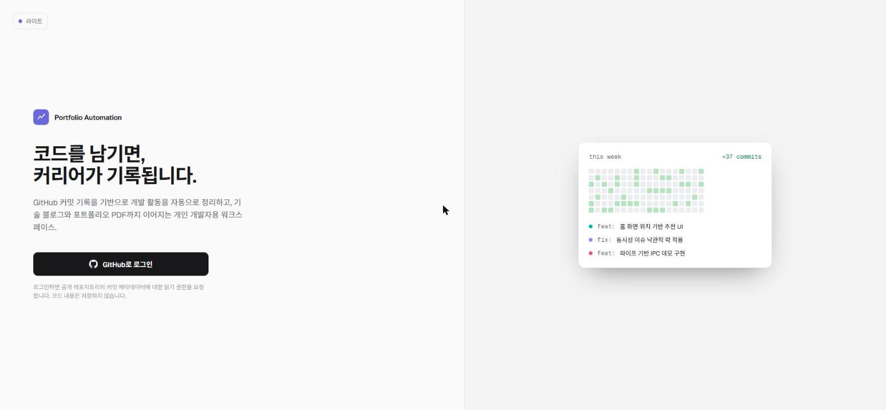
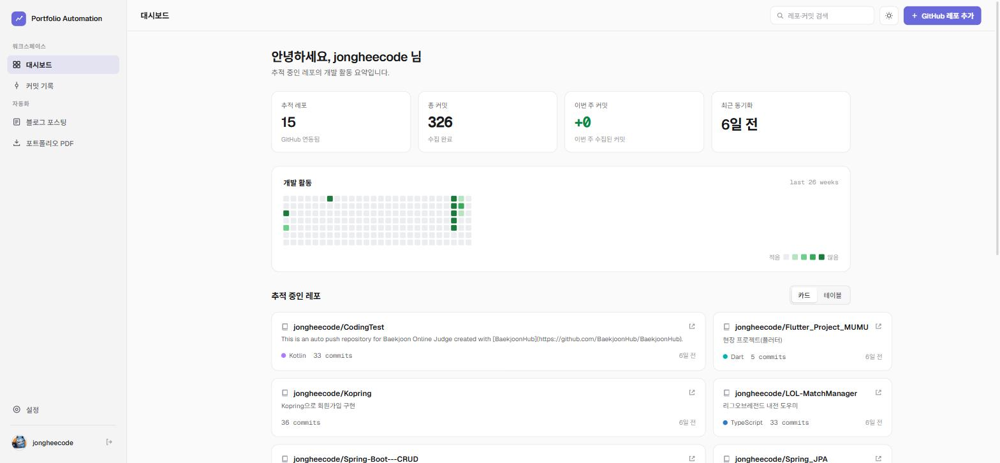
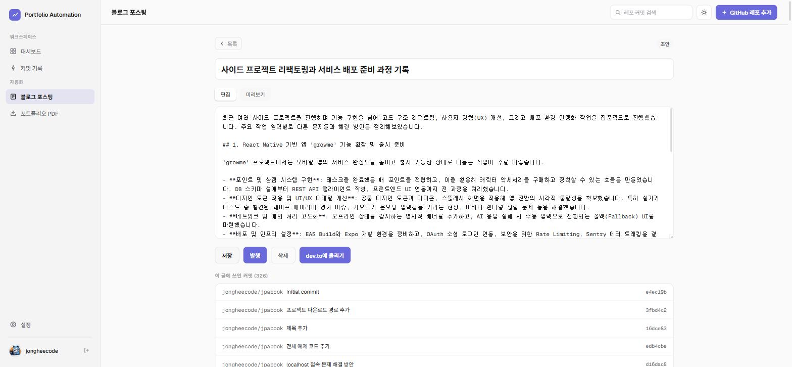
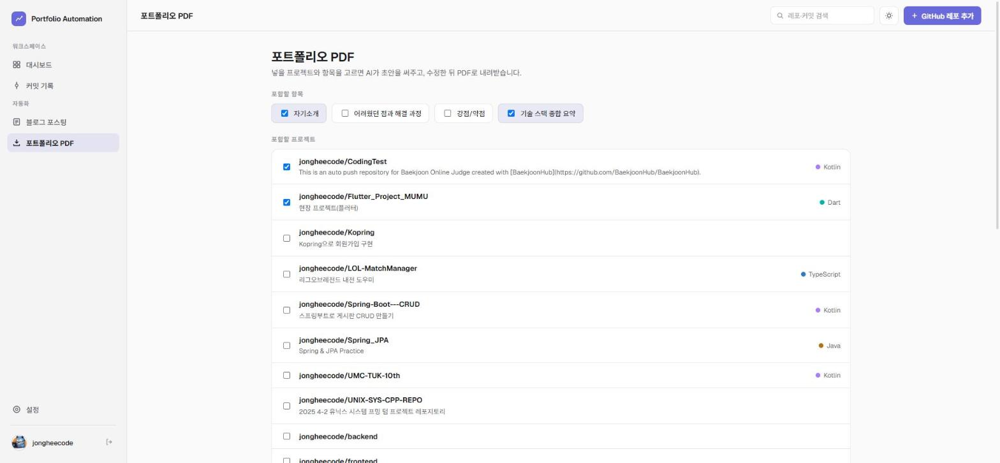
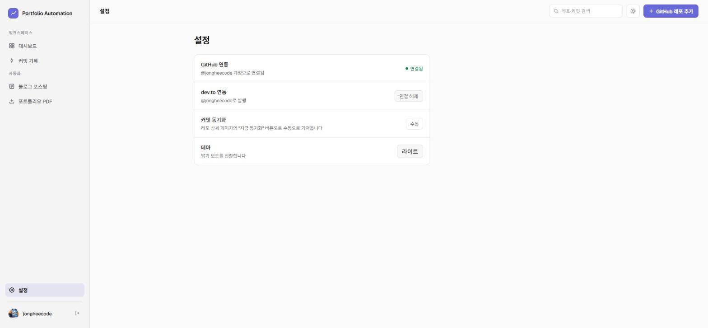

# Portfolio Automation

개발 기록을 남기는 게 항상 귀찮았다. 커밋은 쌓이는데 블로그는 안 쓰고, 포트폴리오는 취업/이직 시즌 되면 급하게 만들고. 그래서 GitHub 커밋만 있으면 나머지는 자동으로 되게 만들어봤다. 커밋을 모아서 기술 블로그 초안을 써주고, 레포를 골라서 포트폴리오 PDF도 뽑아준다.

혼자 쓰려고 만든 개인 프로젝트라 로그인은 GitHub 계정 하나로 끝난다.



## 뭘 할 수 있나

**GitHub 레포를 등록하면 커밋을 자동으로 모아준다.**

추적할 레포를 추가하면 그 레포의 커밋 기록을 가져와서 쌓아둔다. 대시보드에서 얼마나 커밋했는지, 어떤 레포를 얼마나 건드렸는지 한눈에 볼 수 있다.



**아직 블로그에 안 쓴 커밋을 모아서 초안을 써준다.**

"새 초안 생성"을 누르면 여태 글로 정리 안 한 커밋들을 모아서 AI(Gemini)가 무슨 작업을 했는지 정리한 초안을 써준다. 그대로 쓸 수도 있고 편집해서 다듬을 수도 있다. 다 됐으면 dev.to에 바로 올린다.



**레포 몇 개 골라서 포트폴리오 PDF도 뽑는다.**

포함하고 싶은 프로젝트와 넣고 싶은 항목(자기소개, 기술 스택 등)을 고르면 README랑 커밋 기록을 바탕으로 초안을 써준다. 편집하고 PDF로 다운로드하면 끝.



**설정은 계정 연동 두 개뿐.**

GitHub은 로그인할 때 이미 연동돼 있고, dev.to는 API 키 하나만 넣으면 연결된다. OAuth 앱 등록 같은 거 필요 없다.



## 어떻게 만들었나

- 백엔드: Kotlin + Spring Boot (GitHub OAuth 로그인, PostgreSQL)
- 프론트: React + TypeScript + Vite
- 블로그/포트폴리오 초안: Google Gemini API
- 블로그 발행: dev.to Open API

## 로컬에서 돌려보기

### 1. GitHub OAuth App 등록

https://github.com/settings/developers 에서 OAuth App 하나 만든다.
- Homepage URL: `http://localhost:5173`
- Authorization callback URL: `http://localhost:8080/login/oauth2/code/github`

### 2. Gemini API 키 발급

https://ai.google.dev (Google AI Studio) 에서 무료로 발급받으면 된다.

### 3. DB 띄우기

```
docker compose up -d
```

### 4. 백엔드 실행

`backend/.env.local`(gitignore됨)에 아래 값을 채워넣고:

```
GITHUB_CLIENT_ID=...
GITHUB_CLIENT_SECRET=...
GEMINI_API_KEY=...
```

```
cd backend
set -a && . ./.env.local && set +a && ./gradlew bootRun
```

기본 포트는 8080.

### 5. 프론트 실행

```
cd frontend
npm install
npm run dev
```

기본 포트는 5173. `.env.example` 참고해서 API 주소를 바꿀 수 있다(기본값 `http://localhost:8080`).

### 6. 써보기

`http://localhost:5173`에서 GitHub로 로그인 → 추적할 레포 등록 → 동기화 → 블로그/PDF 페이지에서 초안 생성.

dev.to 발행은 계정 설정(Settings → Extensions → DEV Community API Keys)에서 API 키를 발급받아 앱 설정 페이지에 붙여넣으면 된다.
